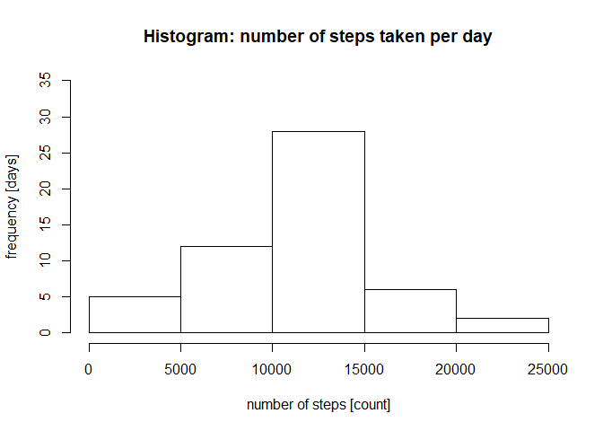
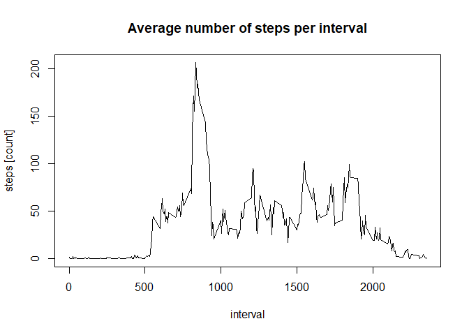
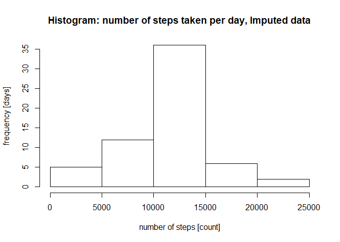
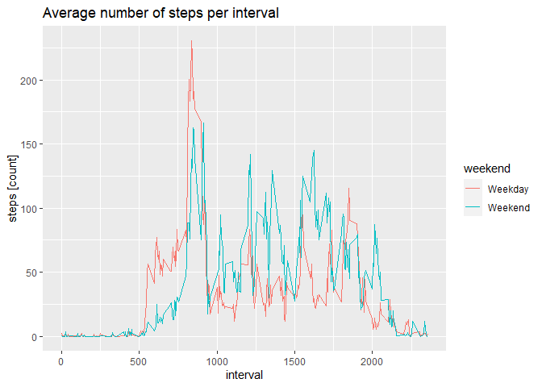

## Loading and preprocessing the data
This section will load the data and transform the date feature to a date format.

```r
unzip("activity.zip")
data<-read.csv('activity.csv')
data<-transform(data, date=as.Date(date))
```


## What is mean total number of steps taken per day?
By aggregating the data by day we can get the total number of steps as shown in the table below.


```r
nSteps<-aggregate(steps~date, data=data, sum)
library(xtable)
xt<-xtable(transform(nSteps, date=as.character(date)))
print(xt, type="html")
```

<!-- html table generated in R 3.6.3 by xtable 1.8-4 package -->
<!-- Thu Apr 16 12:42:43 2020 -->
<table border=1>
<tr> <th>  </th> <th> date </th> <th> steps </th>  </tr>
  <tr> <td align="right"> 1 </td> <td> 2012-10-02 </td> <td align="right"> 126 </td> </tr>
  <tr> <td align="right"> 2 </td> <td> 2012-10-03 </td> <td align="right"> 11352 </td> </tr>
  <tr> <td align="right"> 3 </td> <td> 2012-10-04 </td> <td align="right"> 12116 </td> </tr>
  <tr> <td align="right"> 4 </td> <td> 2012-10-05 </td> <td align="right"> 13294 </td> </tr>
  <tr> <td align="right"> 5 </td> <td> 2012-10-06 </td> <td align="right"> 15420 </td> </tr>
  <tr> <td align="right"> 6 </td> <td> 2012-10-07 </td> <td align="right"> 11015 </td> </tr>
  <tr> <td align="right"> 7 </td> <td> 2012-10-09 </td> <td align="right"> 12811 </td> </tr>
  <tr> <td align="right"> 8 </td> <td> 2012-10-10 </td> <td align="right"> 9900 </td> </tr>
  <tr> <td align="right"> 9 </td> <td> 2012-10-11 </td> <td align="right"> 10304 </td> </tr>
  <tr> <td align="right"> 10 </td> <td> 2012-10-12 </td> <td align="right"> 17382 </td> </tr>
  <tr> <td align="right"> 11 </td> <td> 2012-10-13 </td> <td align="right"> 12426 </td> </tr>
  <tr> <td align="right"> 12 </td> <td> 2012-10-14 </td> <td align="right"> 15098 </td> </tr>
  <tr> <td align="right"> 13 </td> <td> 2012-10-15 </td> <td align="right"> 10139 </td> </tr>
  <tr> <td align="right"> 14 </td> <td> 2012-10-16 </td> <td align="right"> 15084 </td> </tr>
  <tr> <td align="right"> 15 </td> <td> 2012-10-17 </td> <td align="right"> 13452 </td> </tr>
  <tr> <td align="right"> 16 </td> <td> 2012-10-18 </td> <td align="right"> 10056 </td> </tr>
  <tr> <td align="right"> 17 </td> <td> 2012-10-19 </td> <td align="right"> 11829 </td> </tr>
  <tr> <td align="right"> 18 </td> <td> 2012-10-20 </td> <td align="right"> 10395 </td> </tr>
  <tr> <td align="right"> 19 </td> <td> 2012-10-21 </td> <td align="right"> 8821 </td> </tr>
  <tr> <td align="right"> 20 </td> <td> 2012-10-22 </td> <td align="right"> 13460 </td> </tr>
  <tr> <td align="right"> 21 </td> <td> 2012-10-23 </td> <td align="right"> 8918 </td> </tr>
  <tr> <td align="right"> 22 </td> <td> 2012-10-24 </td> <td align="right"> 8355 </td> </tr>
  <tr> <td align="right"> 23 </td> <td> 2012-10-25 </td> <td align="right"> 2492 </td> </tr>
  <tr> <td align="right"> 24 </td> <td> 2012-10-26 </td> <td align="right"> 6778 </td> </tr>
  <tr> <td align="right"> 25 </td> <td> 2012-10-27 </td> <td align="right"> 10119 </td> </tr>
  <tr> <td align="right"> 26 </td> <td> 2012-10-28 </td> <td align="right"> 11458 </td> </tr>
  <tr> <td align="right"> 27 </td> <td> 2012-10-29 </td> <td align="right"> 5018 </td> </tr>
  <tr> <td align="right"> 28 </td> <td> 2012-10-30 </td> <td align="right"> 9819 </td> </tr>
  <tr> <td align="right"> 29 </td> <td> 2012-10-31 </td> <td align="right"> 15414 </td> </tr>
  <tr> <td align="right"> 30 </td> <td> 2012-11-02 </td> <td align="right"> 10600 </td> </tr>
  <tr> <td align="right"> 31 </td> <td> 2012-11-03 </td> <td align="right"> 10571 </td> </tr>
  <tr> <td align="right"> 32 </td> <td> 2012-11-05 </td> <td align="right"> 10439 </td> </tr>
  <tr> <td align="right"> 33 </td> <td> 2012-11-06 </td> <td align="right"> 8334 </td> </tr>
  <tr> <td align="right"> 34 </td> <td> 2012-11-07 </td> <td align="right"> 12883 </td> </tr>
  <tr> <td align="right"> 35 </td> <td> 2012-11-08 </td> <td align="right"> 3219 </td> </tr>
  <tr> <td align="right"> 36 </td> <td> 2012-11-11 </td> <td align="right"> 12608 </td> </tr>
  <tr> <td align="right"> 37 </td> <td> 2012-11-12 </td> <td align="right"> 10765 </td> </tr>
  <tr> <td align="right"> 38 </td> <td> 2012-11-13 </td> <td align="right"> 7336 </td> </tr>
  <tr> <td align="right"> 39 </td> <td> 2012-11-15 </td> <td align="right">  41 </td> </tr>
  <tr> <td align="right"> 40 </td> <td> 2012-11-16 </td> <td align="right"> 5441 </td> </tr>
  <tr> <td align="right"> 41 </td> <td> 2012-11-17 </td> <td align="right"> 14339 </td> </tr>
  <tr> <td align="right"> 42 </td> <td> 2012-11-18 </td> <td align="right"> 15110 </td> </tr>
  <tr> <td align="right"> 43 </td> <td> 2012-11-19 </td> <td align="right"> 8841 </td> </tr>
  <tr> <td align="right"> 44 </td> <td> 2012-11-20 </td> <td align="right"> 4472 </td> </tr>
  <tr> <td align="right"> 45 </td> <td> 2012-11-21 </td> <td align="right"> 12787 </td> </tr>
  <tr> <td align="right"> 46 </td> <td> 2012-11-22 </td> <td align="right"> 20427 </td> </tr>
  <tr> <td align="right"> 47 </td> <td> 2012-11-23 </td> <td align="right"> 21194 </td> </tr>
  <tr> <td align="right"> 48 </td> <td> 2012-11-24 </td> <td align="right"> 14478 </td> </tr>
  <tr> <td align="right"> 49 </td> <td> 2012-11-25 </td> <td align="right"> 11834 </td> </tr>
  <tr> <td align="right"> 50 </td> <td> 2012-11-26 </td> <td align="right"> 11162 </td> </tr>
  <tr> <td align="right"> 51 </td> <td> 2012-11-27 </td> <td align="right"> 13646 </td> </tr>
  <tr> <td align="right"> 52 </td> <td> 2012-11-28 </td> <td align="right"> 10183 </td> </tr>
  <tr> <td align="right"> 53 </td> <td> 2012-11-29 </td> <td align="right"> 7047 </td> </tr>
   </table>
We can also make a histogram showing the freuquency of steps per day, see below.

```r
hist(nSteps$steps, main="Histogram: number of steps taken per day", xlab="number of steps [count]", ylab="frequency [days]", ylim=c(0,35))
```

<!-- -->

The mean and median is computed as

```r
meanSteps <- format(round(mean(nSteps$steps),1), nsmall=1)
medianSteps <- format(round(median(nSteps$steps),1),nsmall=1)
```
where we get a mean of 10766.2 steps/day and a median of 10765.0 steps/day.

## What is the average daily activity pattern?
By instead aggregating on the interval we get the mean number of steps per interval, see the plot below.

```r
meanStepsInterval<-aggregate(steps~interval, data=data, mean)
plot(meanStepsInterval$interval, meanStepsInterval$steps, type="l", main="Average number of steps per interval", xlab="interval", ylab="steps [count]") 
```

<!-- -->
The maximum number of steps taken, as a mean, is

```r
idx<-which.max(meanStepsInterval$steps)
maxStep<-format(round(meanStepsInterval$steps[idx],1),nsmall=1) 
maxStepInterval<-meanStepsInterval$interval[idx]
```
206.2 steps found at interval 835, which corresponds to the time 8.35AM.


## Imputing missing values
In this data set there are some missing values, found as

```r
sum(is.na(data$steps))
```

```
## [1] 2304
```

In order to get a more accurate analysis of the data we will impute the missing values with the mean value of the corresponding interval, which has been computed earlier in `meanSteps`. The code snippet below will loop through all rows of `data` and create a new table, `dataImputed`, that will contain imputed values.

```r
dataImputed <- data
for(i in 1:nrow(dataImputed))
{
    if(is.na(dataImputed$steps[i]))
    {
        replacementvalue <- meanStepsInterval[meanStepsInterval$interval==dataImputed$interval[i],2]
        dataImputed$steps[i]<-replacementvalue
    }
}
```
The histogram of the new table is computed and shown belown. We see a higher frequency in the range 10 000-15 000 steps per day, which makes sense. Since this category is the most common one, it's probable that the replacement values for each interval will contribute most to this category.

```r
nStepsImputed<-aggregate(steps~date, data=dataImputed, sum)
hist(nStepsImputed$steps, main="Histogram: number of steps taken per day, Imputed data", xlab="number of steps [count]", ylab="frequency [days]")
```

<!-- -->

The mean and median is updated

```r
meanStepsImputed <- format(round(mean(nStepsImputed$steps),1), nsmall=1)
medianStepsImputed <- format(round(median(nStepsImputed$steps),1),nsmall=1)
```
where we get the same mean as before 10766.2/day,which is explainable by the fact that we are replacing with mean values. The median is slightly higher, 10766.2/day. The explanation is that we replaced with mean values, which were higher than the (previous) median values, hence the median is increased.


## Are there differences in activity patterns between weekdays and weekends?
To answer the question on how the activity changes over the week we will construct a new column, indicating whether it is the weekend or not, see code below.

```r
Sys.setlocale(category = "LC_ALL", locale = "english")
```

```
## [1] "LC_COLLATE=English_United States.1252;LC_CTYPE=English_United States.1252;LC_MONETARY=English_United States.1252;LC_NUMERIC=C;LC_TIME=English_United States.1252"
```

```r
dataImputed <- cbind(dataImputed, weekend=factor(weekdays(dataImputed$date) %in% c("Saturday", "Sunday"), labels = c("Weekday", "Weekend")))
head(dataImputed)
```

```
##       steps       date interval weekend
## 1 1.7169811 2012-10-01        0 Weekday
## 2 0.3396226 2012-10-01        5 Weekday
## 3 0.1320755 2012-10-01       10 Weekday
## 4 0.1509434 2012-10-01       15 Weekday
## 5 0.0754717 2012-10-01       20 Weekday
## 6 2.0943396 2012-10-01       25 Weekday
```

We can now view the changes in activity by aggregating on weekend/weekday

```r
library(ggplot2)

meanStepsIntervalImputed<-aggregate(steps~interval+weekend, data=dataImputed, mean)

qplot(interval, steps, data=meanStepsIntervalImputed, col=weekend, geom="line", main="Average number of steps per interval", xlab="interval", ylab="steps [count]") 
```

<!-- -->
 When comparing the activity we find that during the weekdays the person tend to walk more in the morning and less in the afternoon, compared to weekends.

